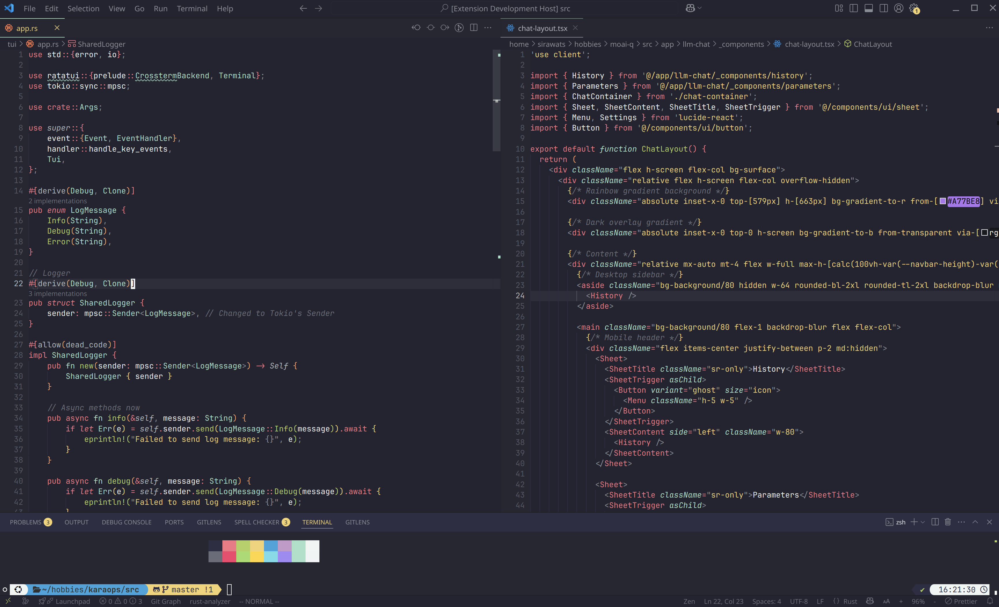

# Moondrop Theme for VS Code

Moondrop is a modern, elegant dark theme for Visual Studio Code, designed for a comfortable and visually pleasing coding experience.

## Features

- Carefully selected color palette for readability and aesthetics
- Consistent syntax highlighting across languages
- Subtle UI accents for focus and clarity

## Installation

1. Search for `moondrop-theme-vscode` in the VS Code Extensions Marketplace and install.
2. Open the Command Palette (`Ctrl+K Ctrl+T` or `Cmd+K Cmd+T` on Mac) and select **Moondrop Theme**.

## Feedback & Contributions

Feel free to open issues or pull requests on [GitHub](https://github.com/sirawats/moondrop-theme-vscode).

---

Enjoy coding with Moondrop! 🌙
